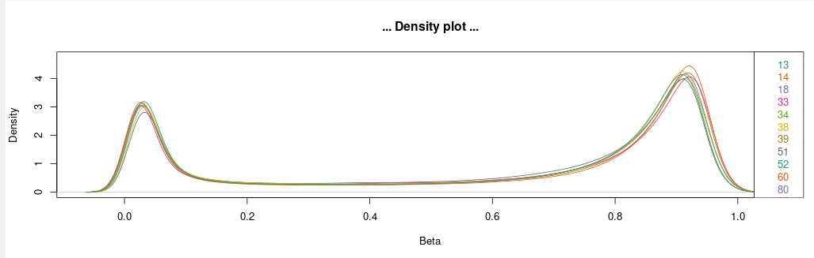
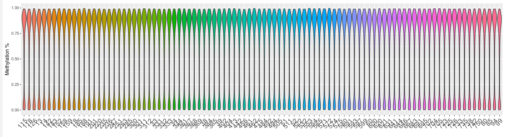
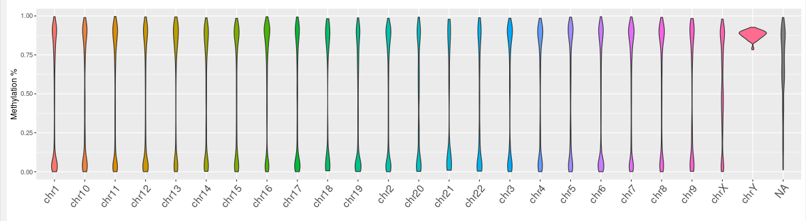
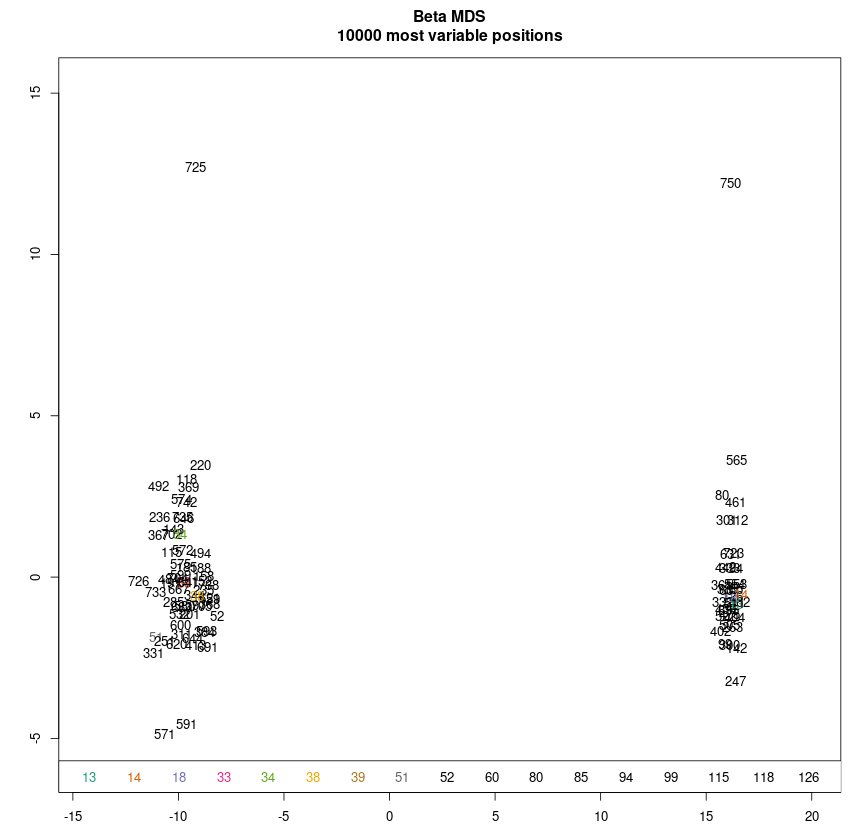
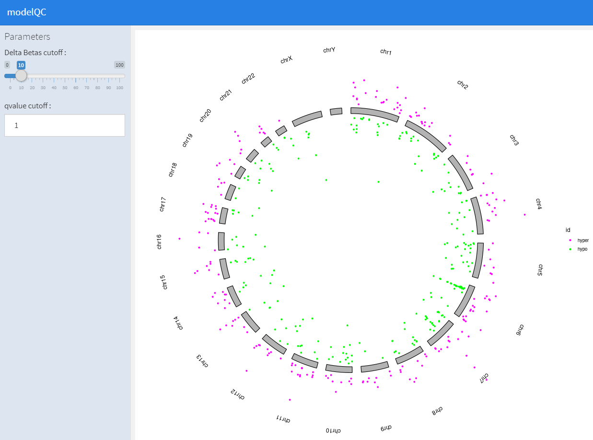
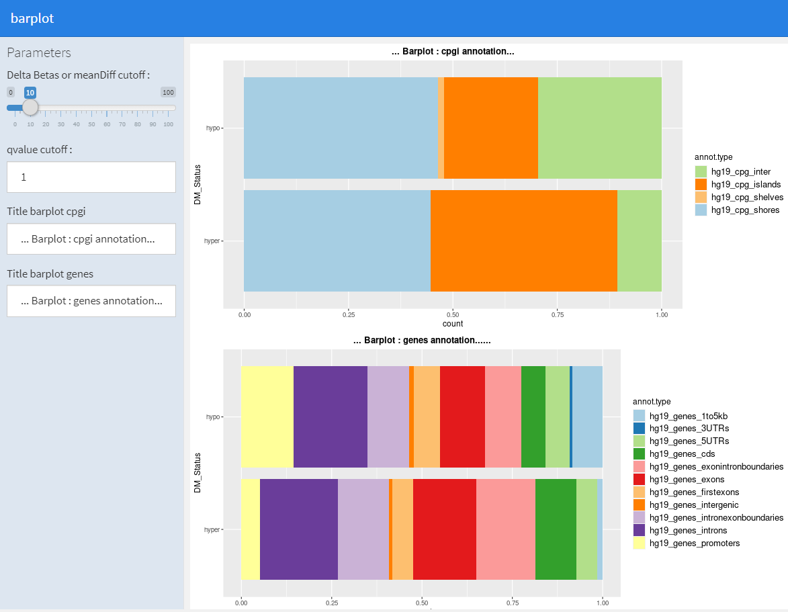
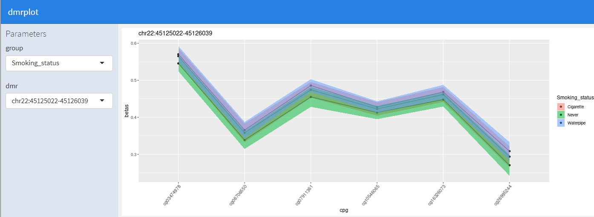

# Methylkey

1. Preprocessing illumina array with minfi
2. Plot QC report
3. Differential methylation analysis
4. Plot Analysis report
5. Create Annotations


Prerequisites :

```bash
install.packages("R.utils")
if (!requireNamespace("BiocManager", quietly = TRUE))
    install.packages("BiocManager")
BiocManager::install("minfi")
BiocManager::install("IlluminaHumanMethylationEPICmanifest")
BiocManager::install("IlluminaHumanMethylationEPICanno.ilm10b4.hg19")
BiocManager::install("wateRmelon")
BiocManager::install("limma")
BiocManager::install("DMRcate")
BiocManager::install("DMRcatedata")
BiocManager::install("ggplot2")


install.packages("devtools") # if you don't have the package, run install.packages("devtools")
library(devtools)
install_github("sailalithabollepalli/EpiSmokEr")
```


## 1. Preprocessing illumina array with Minfi

[The minfi User’s Guide](http://bioconductor.org/packages/release/bioc/vignettes/minfi/inst/doc/minfi.html)

### 1.1 Command line

```bash
  Rscript methylkey/R/dataLoader.minfi.r --pdata pdata.csv --idat idat --group Smoking_status,Sentrix_ID --model ~Smoking_status --out waterpipe
```

Run the same from gitlab

```bash
  Rscript <(curl http://git.iarc.lan/EGE/methylkey/raw/master/R/dataLoader.minfi.r) --pdata pdata.csv --idat idat --group Smoking_status,Sentrix_ID --model ~Smoking_status --out waterpipe
```

### 1.2 Inputs

You can start from your idat files and a sample sheet, in that case use --pdata and --idat parameters for your inputs.<br/>
Or you can resume an analysis using an rda object generated by a previous run. Use --meth parameter.<br/>
(This file contain the RGset object + all parameters + some results)

  | Mandatory parameters   | Example value       |     Description                                                          |
  |:-----------------------|:--------------------|:-------------------------------------------------------------------------|
  | --pdata                | pdata.tsv           | Sample sheet in tsv format (tabular sepated texte file)                  |
  | --idat                 | ./idat              | Folder containing all idat files                                         |
  |   or                   |                     |                                                                          |
  | --meth                 | myproject/RGset.rda | RGset.rda file                                                           |
 

* pdata is a tabular file with samples as lines and variables as columns. This file must include : 
  * samples names (which have to be unique)
  * Barcode (203021070069_R03C01) : this code is the link between samples and idat files. The fist number (203021070069) is the sentrix id, while (R03C01) is the sentrix position. The associated idat files are *203021070069_R03C01_red.idat* for the red channel and *203021070069_R03C01_green.idat* for the green channel.

* idat is a folder that contains all idats files associated with your samples.

* RGset.rda file is generated by this script to save the minfi RGset object. It contains 3 objects : 
  * opt_  : Parameters of your analysis.
  * RGset : minfi object required by several tools that contains all idats informations.
  * Analysis : Formatted pdata + some intermédiate results

### 1.3 Parameters

  | Optional parameters    | Example value   |     Description                                                          |
  |:-----------------------|:----------------|:-------------------------------------------------------------------------|
  | --normalize            | SWANoob         | Normalization method : default(Funnorm)  <br/> Funnorm, Illumina, Noob, Quantile, SWANoob or SWAN |
  | --samples              | Sample_ID       | Samples' column names in the sample sheet                                |
  | --barcode              | Sentrix_ID      | Barcodes' column names in the sample sheet                               |
  | --groups               | Smoking,Age     | List of groups (columns' names in Sample sheet), Default is Sentrix_ID.<br/> The first group is used to calculate mean betas<br/>  when replacing NA values by mean by group. |
  | --missing              | mean            | Missing values : <br/>1- mean   : replace by mean by group (default) <br/>2- impute : impute missing values with pamr <br/>3- keep   : keep na values |
  | --nalimit              | 0.2             | Remove probes with proportion of missing value above this threshold.     |
  | --pval                 | 0.02            | Remove probes with signal Pvalue above this threshold.                   |
  | --model                | ~Smoking        | Model used for SVA batch correction                                      |
  | --separator            | "\t"            | Field separator for Sample Sheet (default "\t")                          |
  | --out                  | myproject/      | Output folder name (default minfi_result)                                |
  | --badsamples           | mylist.txt      | Texte file, each line is the id of a sample to remove from the analysis  |
  | --filter               | Sex_EPIC.csv    | file(s) listing probes to remove from the analysis <br/>  default for EPIC : Crossreactive_probes_EPIC.csv,SNP_EPIC,SNP_ALL_races_5percent.csv,Sex_EPIC.csv |
  
* model : In the model you put the variables you want to protect from batch correction. You should at least protect your main variable, but you can also add covariates with '+'. eg ~Smoking+Gender+Age
* badsamples : If one or more samples are out of the limits in Quality Control report, you can rerun the analysis by removing them using this option. Alternativelly you can remove them from the samplesheet.
* filter : 
  * Pidsley, R., Zotenko, E., Peters, T.J. et al. Critical evaluation of the Illumina MethylationEPIC BeadChip microarray for whole-genome DNA methylation profiling. Genome Biol 17, 208 (2016). https://doi.org/10.1186/s13059-016-1066-1
  * Yi-an Chen, Mathieu Lemire, Sanaa Choufani, Darci T. Butcher, Daria Grafodatskaya, Brent W. Zanke, Steven Gallinger, Thomas J. Hudson & Rosanna Weksberg (2013) Discovery of cross-reactive probes and polymorphic CpGs in the Illumina Infinium HumanMethylation450 microarray, Epigenetics, 8:2, 203-209, https://doi.org/10.4161/epi.23470


  | Flags parameters       |     Description              |
  |:-----------------------|:-----------------------------|
  | --nosva                | Do not run batch correction  |


After running you should find in the result folder, 4 QC plots : 
* Boxplots for the color Channels before normalization.
* Quality control (getQC)


## 2. Plot QC report

The report is generated by the Rmarkdown file minfiQC.Rmd. You can use it by executing it in Rstudio, just edit the meth parameter to point to the correct betas.rda file. 
It open a shiny application that let you customize your plots and explore variables. Five plots are presented : Density plot, Density Bean plot, Violin plot by samples, violin plot by chromosome and MDS plot.

  
  
  
  
  

## 3. Differential methylation analysis

### 3.1 Command line

```bash
   Rscript methylkey/R/methylkey.diff.r --meth waterpipe/Funnorm/betas.rda --model ~Smoking_status+Gender --case Waterpipe --control Never --dmrcate --annot --annotatr methylkey/annotatr/annot.hg19.rda
```

### 3.2 Input

The only input required is the betas.rda file you get from dataLoader.minfi.r (or alternatively the mval.rda).

  | Mandatory parameters   | Example value                 |     Description                                                          |
  |:-----------------------|:------------------------------|:-------------------------------------------------------------------------|
  | --meth                 | waterpipe/Funnorm/betas.rda   | Sample sheet in tsv format (tabular sepated texte file)                  |
  

### 3.3 Parameters

  | Optional parameters    | Example value    |     Description                                                                   |
  |:-----------------------|:-----------------|:----------------------------------------------------------------------------------|
  | --model                | ~Smoking_status  | Model to use for the analysis                                                     |
  | --case                 | Waterpipe        | Case status                                                                       |
  | --control              | Sentrix_ID       | Control status                                                                    |
  | --fdr                  | 0.05             | Cutoff Qvalue for significant dmps in toptable (default=0.05)                     |
  | --pval                 | 0.1              | All dmps with pvalue below this cutoff are used for DMR analysis (default=0.05)   |
  | --reg                  | ls               | Regression method : ls (default), robust, logistic                                |
  | --niter                | 25               | Number of iteration when using robust regression (default=25)                     |
  | --ncore                | 4                | Number of core for computation (default=4)                                        |
  
  
  | Flags parameters       |     Description              |
  |:-----------------------|:-----------------------------|
  | --dmrcate              | Compute DMRs                 |
  
### 3.4 Annotation 

see section 5. annotation with annotatr

  | Flags parameters       |     Description                           |
  |:-----------------------|:------------------------------------------|
  | --annot                | annotate results with annotatr            |

  To save computation time, you can provide annotation file with --annotatr parameter (See section 5.1).

  | Optional parameters    | Example value                         | Description                         |
  |:-----------------------|:--------------------------------------|:------------------------------------|
  | --annotatr             | methylkey/annotatr/annot.hg19.rda     | use custom annotation               |


### 4. Plot Analysis report

## 4.1 Circosplot

With the circosPlot.Rmd file, you can generate a circosplot showing distribution of dmrs among chromosomes.
There is one parameter :
  * meth : the dmrs analysis result file ( *.dmrs.rda )



## 4.2 Barplots

With the barplot.Rmd file, you can generate barplots showing distribution of dmrs among genes structures and CpG islands regions.
There is four input parameters : 
  * meth : the dmrs analysis result file ( *.dmrs.rda )
  * annotgene : is the annotation for genes (see annotation with annotatr)
  * annotcpgi : is the annotation for cpgi (see annotation with annotatr)

 

## 4.3 Dmrs explorator

With the dmrplot.Rmd, you can explore your best dmrs and check differential expression for each dmps.
There is one input parameter :
  * meth : the dmrs analysis result file ( *.dmrs.rda )
  
  


# 5. Create Annotations

## 5.1 Create annotation file for methyldiff

The annotation step require a Genomic ranges object with at least the following metadata column :

 | Column                 | Description         | Example value                 |
 |:-----------------------|:--------------------|-------------------------------|
 | id                     | id of annotation    | miRNA:61                      |
 | tx_id                  | taxonomic ID        | ENST00000516761.1             |
 | gene_id                | gene id             | 84559                         |
 | symbol                 | gene symbol         | GOLGA2P2Y                     |
 | type                   | annotation type     | hg19_lncrna_gencode           |
 
 These GRanges object can be created using annotatr package

```bash
genome="hg38"

#all annotations
all_annots<-listOfAnnotations[grep(genome, listOfAnnotations)]
annot <- build_annotations(genome = genome, annotations = all_annots)

#or you can select a specific annotation in all_annots
annot <- build_annotations(genome = genome, annotations = "hg38_basicgenes")

#save it
save(anno)
```

## 5.2 Annotations with annotatr


```bash
source("R/annotation.r")
manifest<-fread("illumina/EPIC.hg19.manifest.tsv.gz")
colnames(manifest)[1:4]<-c("chr","start","end","strand")
manifest<-makeGRangesFromDataFrame(manifest[!is.na(chr),], keep.extra.columns=TRUE)
```

# Appendix


The minfi package is described in:

Aryee MJ, Jaffe AE, Corrada-Bravo H, Ladd-Acosta C, Feinberg AP, Hansen KD, Irizarry RA (2014). “Minfi: A flexible and
comprehensive Bioconductor package for the analysis of Infinium DNA Methylation microarrays.” _Bioinformatics_, *30*(10),
1363-1369. doi: 10.1093/bioinformatics/btu049 (URL: https://doi.org/10.1093/bioinformatics/btu049).

SWAN normalization (preprocessSWAN) is described in:

Maksimovic J, Gordon L, Oshlack A (2012). “SWAN: Subset quantile Within-Array Normalization for Illumina Infinium
HumanMethylation450 BeadChips.” _Genome Biology_, *13*(6), R44. doi: 10.1186/gb-2012-13-6-r44 (URL:
https://doi.org/10.1186/gb-2012-13-6-r44).

Funnorm normalization (preprocesFunnorm) is described in:

Fortin J, Labbe A, Lemire M, Zanke BW, Hudson TJ, Fertig EJ, Greenwood CM, Hansen KD (2014). “Functional normalization of 450k
methylation array data improves replication in large cancer studies.” _Genome Biology_, *15*(12), 503. doi:
10.1186/s13059-014-0503-2 (URL: https://doi.org/10.1186/s13059-014-0503-2).

noob background correction (preprocessNoob) is described in:

Triche TJ, Weisenberger DJ, Van Den Berg D, Laird PW, Siegmund KD (2013). “Low-level processing of Illumina Infinium DNA
Methylation BeadArrays.” _Nucleic Acids Research_, *41*(7), e90. doi: 10.1093/nar/gkt090 (URL:
https://doi.org/10.1093/nar/gkt090).

Reconstruction of A/B compartments (compartments, extractAB) is described in:

Fortin J, Hansen KD (2015). “Reconstructing A/B compartments as revealed by Hi-C using long-range correlations in epigenetic
data.” _Genome Biology_, *16*, 180. doi: 10.1186/s13059-015-0741-y (URL: https://doi.org/10.1186/s13059-015-0741-y).

Gap hunting is described in:

Andrews SV, Ladd-Acosta C, Feinberg AP, Hansen KD, Fallin MD (2016). “'Gap hunting' to characterize clustered probe signals in
Illumina methylation array data.” _Epigenetics & Chromatin_, *9*, 56. doi: 10.1186/s13072-016-0107-z (URL:
https://doi.org/10.1186/s13072-016-0107-z).

Extending minfi to support EPIC arrays is described in:

Fortin J, Triche TJ, Hansen KD (2017). “Preprocessing, normalization and integration of the Illumina HumanMethylationEPIC array
with minfi.” _Bioinformatics_, *33*(4). doi: 10.1093/bioinformatics/btw691 (URL: https://doi.org/10.1093/bioinformatics/btw691).

To see these entries in BibTeX format, use 'print(<citation>, bibtex=TRUE)', 'toBibtex(.)', or set
'options(citation.bibtex.max=999)'.
